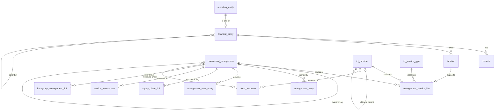

# Canonical Data Model v0.1 (compliance-service)

**Status:** Draft for review  
**Implements:** SPEC-INT-001 (revised specification v2)  
**Machine-readable form:** `canonical-data-model.schema.json` (JSON Schema 2020-12)  
**Source basis:** EBA relational data model for the DORA register of information ("Data Model for DORA RoI", tables B_01.01 to B_07.01)

---

## 1. Purpose and approach

The canonical model is the contract between adapters and the compliance engine. Any source system (NEXOPS ONE, CSV/XLSX import, API, GRC or contract tools) maps its data into this model; the engine never reads source-specific structures.

**Approach: a register-aligned core plus a small extension layer.**

- The core mirrors the tables of the EBA register data model one-to-one where possible, so Profile A export (register of information) is a mapping exercise rather than a transformation.
- Field names are readable snake_case; every field carries its register reference (`x-roi-ref`, for example `B_02.02.0150`) so mappings stay auditable.
- The extension layer (`cloud_resource`) holds technical inventory that is not part of the register but feeds sovereignty analysis and can *propose* values for register fields.

### Scope of the source model, and what it is not

The EBA document is a **relational rendering** of the register: tables, columns, types, keys and nullability. It is not the submission format, and it does not contain the closed value lists (codelists) or the authority's validation rules. Both come from the official taxonomy and validation package and must be layered on top (Section 8).

---

## 2. Design decisions

1. **Partial ingestion is allowed; export is strict.** Schema `required` covers only identity keys. The data model's NOT NULL columns are recorded as `x-roi-required` and enforced at *register completeness* level and at export, never at ingestion. This is how missing data becomes `not_assessed` rather than a rejected batch.
2. **Three field states, not two.** A field is *provided*, *missing* (absent or null), or *not applicable* (declared in `_meta.not_applicable_fields`). Missing and not-applicable are never conflated.
3. **Derived values are labelled.** If an adapter infers a value (for example a country from a cloud region), it lists the field in `_meta.derived_fields` with the method and source. Derived values can populate a draft, but the register-complete check can require human confirmation.
4. **Business keys plus service-assigned IDs.** Adapters supply the register's natural keys. The service assigns its own stable internal ID per record and resolves references, so adapters never need to know internal IDs.
5. **Merged signatory tables.** B_03.01, B_03.02 and B_03.03 share one shape and are modelled as `arrangement_party` with a `role`. Export splits them back.
6. **Wider-of-the-two lengths.** Where the source document conflicts on a column length (Section 7), the canonical model accepts the wider value; the authority's narrower limit is enforced at Profile A validation.
7. **No unknown fields.** Records reject unrecognised properties, so nothing is silently coerced or dropped.

---

## 3. Entity overview and register mapping

| Canonical entity | Register template | Purpose |
|---|---|---|
| `reporting_entity` | B_01.01 | Entity maintaining the register |
| `financial_entity` | B_01.02 | Financial entities in scope |
| `branch` | B_01.03 | Branches |
| `contractual_arrangement` | B_02.01 | Contractual arrangements (general) |
| `arrangement_service_line` | B_02.02 | Contractual arrangements (specific) |
| `intragroup_arrangement_link` | B_02.03 | Intra-group arrangements |
| `arrangement_party` | B_03.01 / B_03.02 / B_03.03 | Arrangement signatories |
| `arrangement_user_entity` | B_04.01 | Financial entities using the services |
| `ict_provider` | B_05.01 | ICT third-party service providers |
| `supply_chain_link` | B_05.02 | ICT service supply chains |
| `function` | B_06.01 | Functions |
| `service_assessment` | B_07.01 | Assessment of ICT services |
| `ict_service_type` | lookup | ICT service type (lookup) |
| `cloud_resource` | extension | Cloud resource (platform extension) |



---

## 4. Common conventions

| Source type | Canonical type | Constraint |
|---|---|---|
| `char(20)` LEI | string | `^[A-Z0-9]{18}[0-9]{2}$` (structure only; check-digit validation is a Level 1b rule) |
| `char(2)` country | string | ISO 3166-1 alpha-2, uppercase |
| `char(3)` currency | string | ISO 4217, uppercase |
| `date` | string | ISO 8601 `YYYY-MM-DD` |
| `money` | number | Decimal; currency carried in the sibling currency field |
| `int` | integer | Non-negative; unit (days, minutes) per official instructions |
| `bit` / `binary` | boolean | |
| `varchar(n)` | string | Max 255 in canonical (see Section 7) |
| coded `varchar` | string with `x-codelist` | Values validated against the official codelist (Section 8) |

**Record metadata (`_meta`, optional on every record):** `source_record_ref`, `not_applicable_fields`, `derived_fields`.

**Batch envelope:** `schema_version`, `source` (system, adapter, adapter_version), optional `batch` (id, generated_at, mode `full` or `incremental`), and `entities`.

---

## 5. Entity definitions

Legend. **Key:** `identity` = required at ingestion and part of the record's identity; `RoI composite` = part of the register's composite primary key but optional at ingestion (a missing value counts as unknown in the key). **Export-required:** NOT NULL in the EBA data model; `yes*` = NOT NULL in the model but plausibly conditional, to be confirmed against the official rules.

### `reporting_entity`  (B_01.01)

The financial entity that maintains and submits the register of information.

**Identity:** `lei`

| Field | RoI ref | Type | Key | References | Export-required | Description |
|---|---|---|---|---|---|---|
| `lei` | 0010 | lei | identity |  | yes | LEI of the entity maintaining the register. |
| `name` | 0020 | str |  |  | yes | Name of the entity. |
| `country` | 0030 | country |  |  | yes | Country of the entity (ISO 3166-1 alpha-2). |
| `entity_type` | 0040 | code (entity_type) |  |  | yes | Type of entity. |
| `competent_authority` | 0050 | code (competent_authority) |  |  | yes | Competent authority. |
| `reporting_date` | 0060 | date |  |  | yes | Reporting reference date. |

### `financial_entity`  (B_01.02)

Every financial entity within the scope of the register (including the reporting entity itself and group members).

**Identity:** `lei`

| Field | RoI ref | Type | Key | References | Export-required | Description |
|---|---|---|---|---|---|---|
| `lei` | 0010 | lei | identity |  | yes | LEI of the financial entity. |
| `name` | 0020 | str |  |  | yes | Name of the entity. |
| `country` | 0030 | country |  |  | yes | Country of the entity. |
| `entity_type` | 0040 | code (entity_type) |  |  | yes | Type of entity. |
| `group_hierarchy` | 0050 | code (group_hierarchy) |  |  | yes* | Hierarchy of the entity within the group, where applicable. |
| `parent_lei` | 0060 | lei |  | `financial_entity.lei` | no | LEI of the direct parent undertaking. |
| `last_update_date` | 0070 | date |  |  | yes | Date of last update. |
| `integration_date` | 0080 | date |  |  | yes | Date of integration in the register. |
| `deletion_date` | 0090 | date |  |  | yes* | Date of deletion from the register. |
| `currency` | 0100 | currency |  |  | no | Currency of the total assets value. |
| `total_assets` | 0110 | money |  |  | no | Value of total assets of the financial entity. |

### `branch`  (B_01.03)

Branches of financial entities.

**Identity:** `branch_id_code, head_office_lei`

| Field | RoI ref | Type | Key | References | Export-required | Description |
|---|---|---|---|---|---|---|
| `branch_id_code` | 0010 | str | identity |  | yes | Identification code of the branch. |
| `head_office_lei` | 0020 | lei | identity | `financial_entity.lei` | yes | LEI of the head office of the branch. |
| `name` | 0030 | str |  |  | yes | Name of the branch. |
| `country` | 0040 | country |  |  | yes | Country of the branch. |

### `contractual_arrangement`  (B_02.01)

One record per contractual arrangement, with cost and optional link to an overarching arrangement.

**Identity:** `arrangement_ref`

| Field | RoI ref | Type | Key | References | Export-required | Description |
|---|---|---|---|---|---|---|
| `arrangement_ref` | 0010 | str | identity |  | yes | Contractual arrangement reference number. |
| `arrangement_type` | 0020 | code (arrangement_type) |  |  | yes | Type of contractual arrangement. |
| `overarching_arrangement_ref` | 0030 | str |  | `contractual_arrangement.arrangement_ref` | no | Reference of the overarching arrangement (e.g. framework agreement). |
| `currency` | 0040 | currency |  |  | yes | Currency of the reported amount. |
| `annual_cost` | 0050 | money |  |  | yes | Annual expense or estimated cost of the arrangement for the past year. |

### `arrangement_service_line`  (B_02.02)

The core register line: which financial entity uses which provider's ICT service, supporting which function, under which arrangement, with locations, dates and reliance. This is where cloud region and sovereignty data lands.

**Identity:** `arrangement_ref, financial_entity_lei, provider_id_code, function_id, ict_service_type`

| Field | RoI ref | Type | Key | References | Export-required | Description |
|---|---|---|---|---|---|---|
| `arrangement_ref` | 0010 | str | identity | `contractual_arrangement.arrangement_ref` | yes | Contractual arrangement reference number. |
| `financial_entity_lei` | 0020 | lei | identity | `financial_entity.lei` | yes | LEI of the financial entity making use of the ICT service. |
| `provider_id_code` | 0030 | str | identity | `ict_provider.provider_id_code` | yes | Identification code of the ICT third-party service provider. |
| `provider_id_type` | 0040 | code (provider_id_type) |  |  | no | Type of code identifying the provider (e.g. LEI or other). |
| `function_id` | 0050 | str | identity | `function.function_id` | yes | Identifier of the supported function. |
| `ict_service_type` | 0060 | code (ict_service_type) | identity | `ict_service_type.id` | yes | Type of ICT service. |
| `start_date` | 0070 | date |  |  | yes | Start date of the arrangement. |
| `end_date` | 0080 | date |  |  | yes* | End date of the arrangement. |
| `termination_reason` | 0090 | code (termination_reason) |  |  | no | Reason for termination or ending. |
| `notice_period_entity` | 0100 | int |  |  | no | Notice period for the financial entity (unit per official instructions). |
| `notice_period_provider` | 0110 | int |  |  | no | Notice period for the provider (unit per official instructions). |
| `governing_law_country` | 0120 | country |  |  | no | Country of the governing law. |
| `country_of_provision` | 0130 | country | RoI composite |  | yes | Country of provision of the ICT service. |
| `data_stored` | 0140 | bool |  |  | yes* | Whether the provider stores data. |
| `data_at_rest_country` | 0150 | country | RoI composite |  | yes | Location of data at rest (storage). |
| `data_processing_country` | 0160 | country | RoI composite |  | yes | Location of data management (processing). |
| `data_sensitiveness` | 0170 | code (data_sensitiveness) |  |  | no | Sensitiveness of the data stored by the provider. |
| `reliance_level` | 0180 | code (reliance_level) |  |  | no | Level of reliance on the service supporting a critical or important function. |

### `intragroup_arrangement_link`  (B_02.03)

Links an intra-group arrangement to the related arrangement with an external ICT third-party provider.

**Identity:** `intragroup_arrangement_ref, linked_tpp_arrangement_ref`

| Field | RoI ref | Type | Key | References | Export-required | Description |
|---|---|---|---|---|---|---|
| `intragroup_arrangement_ref` | 0010 | str | identity | `contractual_arrangement.arrangement_ref` | yes | Arrangement with the intra-group ICT provider. |
| `linked_tpp_arrangement_ref` | 0020 | str | identity | `contractual_arrangement.arrangement_ref` | yes | Linked arrangement with the ICT third-party provider. |

### `arrangement_party`  (B_03.01 / B_03.02 / B_03.03)

Canonical merge of the three signatory tables into one role-based list. Export splits it back by role.

**Identity:** `arrangement_ref, role, party_id_code`

| Field | RoI ref | Type | Key | References | Export-required | Description |
|---|---|---|---|---|---|---|
| `arrangement_ref` | 0010 | str | identity | `contractual_arrangement.arrangement_ref` | yes | Contractual arrangement reference number. |
| `role` | - | enum | identity |  | yes | recipient_signatory (B_03.01), provider_signatory (B_03.02) or intragroup_provider_signatory (B_03.03). |
| `party_id_code` | 0020 | str | identity |  | yes | LEI of the signing entity, or identification code of the signing provider (per role). |
| `party_id_type` | B_03.02.0030 | code (provider_id_type) |  |  | no | Type of code of the party; used for provider_signatory only. |

### `arrangement_user_entity`  (B_04.01)

Which financial entities (or branches) make use of the ICT services under an arrangement.

**Identity:** `arrangement_ref, financial_entity_lei`

| Field | RoI ref | Type | Key | References | Export-required | Description |
|---|---|---|---|---|---|---|
| `arrangement_ref` | 0010 | str | identity | `contractual_arrangement.arrangement_ref` | yes | Contractual arrangement reference number. |
| `financial_entity_lei` | 0020 | lei | identity | `financial_entity.lei` | yes | LEI of the financial entity. |
| `is_branch` | 0030 | bool |  |  | yes | Whether the entity making use of the services is a branch. |
| `branch_id_code` | 0040 | str | RoI composite | `branch.branch_id_code` | yes* | Identification code of the branch. |

### `ict_provider`  (B_05.01)

Provider master data, including ultimate parent for concentration and sovereignty analysis.

**Identity:** `provider_id_code`

| Field | RoI ref | Type | Key | References | Export-required | Description |
|---|---|---|---|---|---|---|
| `provider_id_code` | 0010 | str | identity |  | yes | Identification code of the provider. |
| `provider_id_type` | 0020 | code (provider_id_type) |  |  | yes | Type of code of the provider. |
| `additional_id_code` | 0030 | str |  |  | no | Additional identification code (typed int in the source model; treated as string, see issues). |
| `additional_id_type` | 0040 | code (provider_id_type) |  |  | no | Type of additional identification code. |
| `legal_name` | 0050 | str |  |  | yes | Legal name of the provider. |
| `name_latin` | 0060 | str |  |  | no | Name in Latin alphabet. |
| `person_type` | 0070 | code (person_type) |  |  | yes | Type of person of the provider. |
| `hq_country` | 0080 | country |  |  | yes | Country of the provider's headquarters. |
| `currency` | 0090 | currency |  |  | no | Currency of the reported amount. |
| `total_annual_cost` | 0100 | money |  |  | no | Total annual expense or estimated cost of the provider. |
| `parent_id_code` | 0110 | str |  | `ict_provider.provider_id_code` | yes* | Identification code of the ultimate parent undertaking. |
| `parent_id_type` | 0120 | code (provider_id_type) |  |  | no | Type of code of the ultimate parent undertaking. |

### `supply_chain_link`  (B_05.02)

Ranked subcontracting chain behind an ICT service.

**Identity:** `arrangement_ref, ict_service_type, provider_id_code, rank, recipient_id_code`

| Field | RoI ref | Type | Key | References | Export-required | Description |
|---|---|---|---|---|---|---|
| `arrangement_ref` | 0010 | str | identity | `contractual_arrangement.arrangement_ref` | yes | Contractual arrangement reference number. |
| `ict_service_type` | 0020 | code (ict_service_type) | identity | `ict_service_type.id` | yes | Type of ICT service. |
| `provider_id_code` | 0030 | str | identity | `ict_provider.provider_id_code` | yes | Identification code of the ICT third-party service provider. |
| `provider_id_type` | 0040 | code (provider_id_type) |  |  | no | Type of code of the provider. |
| `rank` | 0050 | int | identity |  | yes | Rank in the supply chain. |
| `recipient_id_code` | 0060 | str | identity | `ict_provider.provider_id_code` | yes | Identification code of the recipient of sub-contracted ICT services. |
| `recipient_id_type` | 0070 | code (provider_id_type) |  |  | no | Type of code of the recipient. |

### `function`  (B_06.01)

Business functions supported by ICT services, with criticality and recovery objectives.

**Identity:** `function_id, financial_entity_lei`

| Field | RoI ref | Type | Key | References | Export-required | Description |
|---|---|---|---|---|---|---|
| `function_id` | 0010 | str | identity |  | yes | Function identifier. |
| `licensed_activity` | 0020 | code (licensed_activity) |  |  | yes | Licensed activity. |
| `function_name` | 0030 | str |  |  | yes | Function name. |
| `financial_entity_lei` | 0040 | lei | identity | `financial_entity.lei` | yes | LEI of the financial entity. |
| `criticality_assessment` | 0050 | code (criticality_assessment) |  |  | yes | Criticality or importance assessment. |
| `criticality_reasons` | 0060 | str |  |  | no | Reasons for criticality or importance. |
| `last_assessment_date` | 0070 | date |  |  | yes | Date of the last criticality assessment. |
| `rto` | 0080 | int |  |  | yes | Recovery time objective (unit per official instructions). |
| `rpo` | 0090 | int |  |  | yes | Recovery point objective (unit per official instructions). |
| `discontinuing_impact` | 0100 | code (impact_level) |  |  | yes | Impact of discontinuing the function. |

### `service_assessment`  (B_07.01)

Substitutability, exit plan, audit and alternatives per provider service.

**Identity:** `arrangement_ref, provider_id_code, ict_service_type`

| Field | RoI ref | Type | Key | References | Export-required | Description |
|---|---|---|---|---|---|---|
| `arrangement_ref` | 0010 | str | identity | `contractual_arrangement.arrangement_ref` | yes | Contractual arrangement reference number. |
| `provider_id_code` | 0020 | str | identity | `ict_provider.provider_id_code` | yes | Identification code of the provider. |
| `provider_id_type` | 0030 | code (provider_id_type) |  |  | no | Type of code of the provider. |
| `ict_service_type` | 0040 | code (ict_service_type) | identity | `ict_service_type.id` | yes | Type of ICT service. |
| `substitutability` | 0050 | code (substitutability) |  |  | yes | Substitutability of the provider. |
| `not_substitutable_reason` | 0060 | str |  |  | no | Reason if not or hardly substitutable. |
| `last_audit_date` | 0070 | date |  |  | yes | Date of the last audit of the provider. |
| `exit_plan_exists` | 0080 | bool |  |  | yes | Existence of an exit plan. |
| `reintegration_possibility` | 0090 | code (reintegration_possibility) |  |  | yes | Possibility of reintegrating the contracted service. |
| `discontinuing_impact` | 0100 | code (impact_level) |  |  | yes | Impact of discontinuing the ICT services. |
| `alternatives_identified` | 0110 | bool |  |  | yes | Whether alternative providers are identified. |
| `alternative_providers` | 0120 | str |  |  | no | Identification of alternative providers. |

### `ict_service_type`  (lookup)

Reference list of ICT service types. Values come from the official taxonomy.

**Identity:** `id`

| Field | RoI ref | Type | Key | References | Export-required | Description |
|---|---|---|---|---|---|---|
| `id` | - | str | identity |  | yes | Service type identifier. |
| `name` | - | str |  |  | no | Service type name. |
| `description` | - | str |  |  | no | Service type description. |

### `cloud_resource`  (extension)

Technical inventory records (e.g. from NEXOPS ONE). Not part of the register. Used to PROPOSE location and provider facts for service lines; proposals are never written into register fields without being marked as derived.

**Identity:** `resource_ref`

| Field | RoI ref | Type | Key | References | Export-required | Description |
|---|---|---|---|---|---|---|
| `resource_ref` | - | str | identity |  | yes | Source-native stable resource identifier. |
| `provider_key` | - | str |  |  | no | Source-native provider identifier (e.g. slug). |
| `provider_id_code` | - | str |  | `ict_provider.provider_id_code` | no | Link to ict_provider when resolved. |
| `service_name` | - | str |  |  | no | Cloud service name. |
| `resource_category` | - | str |  |  | no | Category (compute, storage, database, ...). |
| `region` | - | str |  |  | no | Provider region code. |
| `country` | - | country |  |  | no | Country resolved from the region. |
| `workspace_ref` | - | str |  |  | no | Workspace or account reference in the source. |
| `linked_arrangement_ref` | - | str |  | `contractual_arrangement.arrangement_ref` | no | Arrangement this resource is believed to fall under. |
| `sovereignty_indicators` | - | object |  |  | no | Namespaced sovereignty signals (jurisdiction of provider and ultimate parent, EU control, etc.). |
| `first_seen` | - | datetime |  |  | no | First observed by the source. |
| `last_seen` | - | datetime |  |  | no | Last observed by the source. |

---

## 6. Validation levels

| Level | Checks | Effect of failure |
|---|---|---|
| **L1 Structural** | JSON Schema: types, patterns, unknown fields, identity keys present | Record rejected with field-level error |
| **L1b Identifier** | LEI check digits, ISO country and currency membership | Record rejected or warned (configurable) |
| **L2 Referential** | Every foreign key resolves inside the batch or the current snapshot; no cycles in `parent_lei`, `parent_id_code`, `overarching_arrangement_ref` | Dangling references reported; dependent controls become `not_assessed` |
| **L3 Register completeness** | All `x-roi-required` fields present per record; codelist membership; conditional rules | Gaps listed in the data-completeness view; Profile A export blocked or marked incomplete |
| **L4 Authority rules** | The authority's published validation rules | Reported in the pre-submission validation report (Profile A) |

L1 and L2 protect data integrity at ingestion. L3 and L4 describe readiness and never block ingestion.

---

## 7. Issues found in the source data model

These are inconsistencies inside the provided document. The canonical model takes the safe choice shown; confirm against the official template.

| # | Observation | Canonical handling |
|---|---|---|
| 1 | B_05.01 field 0030 (additional identification code) is typed `int`, but identifiers are alphanumeric | Treated as string |
| 2 | Column lengths differ between the diagram and the table: B_02.02 function identifier (`varchar(5)` vs 255), B_02.02 fields 0170 and 0180 (`varchar(20)` vs 255), B_06.01 field 0100 (`varchar(20)` vs 255) | Accept up to 255; enforce narrower limits at L4 |
| 3 | Several fields are NOT NULL yet look conditional: `deletion_date`, `group_hierarchy`, `end_date`, `parent_id_code` (ultimate parent), `branch_id_code`, `data_stored` | Marked `yes*`; conditionality to be taken from the official rules |
| 4 | B_02.02 and B_04.01 make location and branch columns part of the primary key while NOT NULL, so "not applicable" needs a defined code in the taxonomy | Optional at ingestion; unknown counts as null in the key; verify not-applicable code values |
| 5 | Field order swaps in the diagram (B_01.02 currency and total assets; B_02.01 currency and annual cost) | Ordering by field code, not diagram position |
| 6 | The `Storage of data` field (B_02.02.0140) has an incomplete nullability entry in the table | Treated as required and conditional |
| 7 | Units for notice periods, RTO and RPO are not stated | Stored as integers; unit taken from official instructions |

---

## 8. Open items

1. **Codelists.** Every `x-codelist` field needs its allowed values (entity types, arrangement types, ICT service types, provider ID types, criticality levels, substitutability, reintegration, impact levels, data sensitiveness, reliance, termination reasons, licensed activities, person types, group hierarchy, competent authorities). The XLS master template should contain these; once provided, they become versioned codelist files loaded like control catalogs.
2. **Conditional rules and authority validations (L3 and L4).** The relational model shows NOT NULL only. Conditional requirements and cross-field checks come from the official validation package. Needed before Profile A.
3. **Export mapping.** A field-by-field map from canonical entities to the submission format (including how `arrangement_party` splits back into B_03.01/02/03).
4. **Semantics of B_05.02 fields 0030 and 0060.** Confirm from the official instructions exactly which party each column identifies in the ranked chain.
5. **Schema version policy.** Register templates change over time; decide how canonical versions track template versions.
6. **Cloud resource mapping.** Define the rules for proposing `country_of_provision`, `data_at_rest_country` and `data_processing_country` from region metadata, and which proposals require manual confirmation.

---

## 9. Relationship to controls (Milestone 8 continuity)

Each control in the catalog declares the canonical fields it needs (SPEC-GOV-001). Examples of how existing Milestone 8 themes map:

| Control theme | Canonical fields it depends on |
|---|---|
| ICT inventory | `ict_provider`, `arrangement_service_line`, `cloud_resource` |
| Third-party visibility | `ict_provider.parent_id_code`, `supply_chain_link`, `arrangement_party` |
| Data residency and location | `arrangement_service_line.country_of_provision`, `data_at_rest_country`, `data_processing_country`, `cloud_resource.country` |
| Concentration and exit readiness | `service_assessment` (substitutability, exit plan, alternatives), `ict_provider.parent_id_code` |
| Resilience and criticality | `function` (criticality, RTO, RPO), `arrangement_service_line.reliance_level` |

If a required field is missing or unresolved, the control is `not_assessed`, never a pass.

---

## 10. Example ingest payload

Sample data only. `EXAMPLE_CODE` stands in for values from official codelists; LEIs are fictitious and do not pass check-digit validation.

```json
{
  "schema_version": "0.1.0",
  "batch": {
    "batch_id": "demo-001",
    "generated_at": "2026-01-15T09:00:00Z",
    "mode": "full"
  },
  "source": {
    "system": "sample-csv",
    "adapter": "csv-import",
    "adapter_version": "0.1.0"
  },
  "entities": {
    "reporting_entity": [
      {
        "lei": "SAMPLEFE000000000001",
        "name": "Sample Fund Manager S.A.",
        "country": "LU",
        "entity_type": "EXAMPLE_CODE",
        "competent_authority": "EXAMPLE_CODE",
        "reporting_date": "2026-03-31"
      }
    ],
    "financial_entity": [
      {
        "lei": "SAMPLEFE000000000001",
        "name": "Sample Fund Manager S.A.",
        "country": "LU",
        "entity_type": "EXAMPLE_CODE",
        "last_update_date": "2026-01-10",
        "integration_date": "2025-01-01"
      }
    ],
    "function": [
      {
        "function_id": "F-001",
        "financial_entity_lei": "SAMPLEFE000000000001",
        "licensed_activity": "EXAMPLE_CODE",
        "function_name": "Portfolio valuation",
        "criticality_assessment": "EXAMPLE_CODE",
        "last_assessment_date": "2025-11-30",
        "rto": 240,
        "rpo": 60,
        "discontinuing_impact": "EXAMPLE_CODE"
      }
    ],
    "ict_provider": [
      {
        "provider_id_code": "SAMPLETP000000000002",
        "provider_id_type": "EXAMPLE_CODE",
        "legal_name": "Sample Cloud Provider Ltd",
        "person_type": "EXAMPLE_CODE",
        "hq_country": "IE",
        "parent_id_code": "SAMPLETP000000000003",
        "parent_id_type": "EXAMPLE_CODE"
      },
      {
        "provider_id_code": "SAMPLETP000000000003",
        "provider_id_type": "EXAMPLE_CODE",
        "legal_name": "Sample Cloud Group Inc",
        "person_type": "EXAMPLE_CODE",
        "hq_country": "US"
      }
    ],
    "contractual_arrangement": [
      {
        "arrangement_ref": "CTR-2024-017",
        "arrangement_type": "EXAMPLE_CODE",
        "currency": "EUR",
        "annual_cost": 48000
      }
    ],
    "arrangement_service_line": [
      {
        "arrangement_ref": "CTR-2024-017",
        "financial_entity_lei": "SAMPLEFE000000000001",
        "provider_id_code": "SAMPLETP000000000002",
        "function_id": "F-001",
        "ict_service_type": "EXAMPLE_CODE",
        "start_date": "2024-03-01",
        "country_of_provision": "IE",
        "data_stored": true,
        "data_at_rest_country": "IE",
        "data_processing_country": "DE",
        "_meta": {
          "derived_fields": [
            {
              "field": "data_at_rest_country",
              "method": "region-to-country",
              "source_ref": "cloud_resource:res-42"
            }
          ]
        }
      }
    ],
    "service_assessment": [
      {
        "arrangement_ref": "CTR-2024-017",
        "provider_id_code": "SAMPLETP000000000002",
        "ict_service_type": "EXAMPLE_CODE",
        "substitutability": "EXAMPLE_CODE",
        "last_audit_date": "2025-06-15",
        "exit_plan_exists": false,
        "reintegration_possibility": "EXAMPLE_CODE",
        "discontinuing_impact": "EXAMPLE_CODE",
        "alternatives_identified": false
      }
    ],
    "cloud_resource": [
      {
        "resource_ref": "res-42",
        "provider_key": "sample-cloud",
        "provider_id_code": "SAMPLETP000000000002",
        "service_name": "Object storage",
        "resource_category": "storage",
        "region": "eu-west-1",
        "country": "IE",
        "sovereignty_indicators": {
          "provider_hq_country": "IE",
          "ultimate_parent_country": "US"
        },
        "last_seen": "2026-01-14T22:00:00Z"
      }
    ]
  }
}
```
